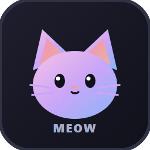

<p align="center">
  
</p>

<h1 align="center">Meow Lang Tools for Visual Studio Code</h1>

<p align="center">
  Comprehensive language support for <b>meow-lang</b> (.meow) in Visual Studio Code.
</p>

---

## ✨ Features

- 🎨 **Rich Syntax Highlighting**:
  - Clear classification of control & declaration keywords (`if`, `switch`, `for`, `function`, `type`...).
  - Highlight built-in prefix functions (`print`, `println`, `add`, `equal`, `range`...) and module namespaces (`console::`, `string::`, `file::`...).
  - Distinction between variables, constants (`const PI`), primitive types, and user-defined structs/interfaces.
  - Specially tuned eye-friendly color palette avoiding harsh white tokens.
- ⚡ **Productive Code Snippets**:
  - Rapidly scaffold common constructs like `print`, `fn`, `type`, `switch`, `for`, `if` with a single `Tab` stroke.
- 📐 **Smart Editing Experience**:
  - Auto-closing pairs for parentheses `()`, brackets `[]`, braces `{}` and single-quoted strings `''`.
  - Automatic indentation and outdent rules when pressing `Enter`.
  - Single-line comments (`//`, shortcut: `Ctrl + /`) and block comments (`/* ... */`).
  - Documentation comments (`/** ... */`) with auto-continuation `* ` on Enter.
  - Code folding for block scopes `{ ... }` as well as `// #region` ... `// #endregion`.

---

## 🚀 Snippets Reference

| Prefix      |  Key  | Expanded Code                                                          |
| :---------- | :---: | :--------------------------------------------------------------------- |
| `print`     | `Tab` | `print('Hello Meow!');`                                                |
| `println`   | `Tab` | `println('Hello Meow!');`                                              |
| `fn`        | `Tab` | `function void name() { ... }` _(with return type dropdown)_           |
| `fnvar`     | `Tab` | `function int sum_all(int... numbers) { ... }` _(variadic parameters)_ |
| `type`      | `Tab` | Struct definition: `type Name { ... }`                                 |
| `interface` | `Tab` | Structural interface: `interface HasContent { ... }`                   |
| `if`        | `Tab` | Conditional statement: `if (condition) { ... }`                        |
| `ifelse`    | `Tab` | Conditional branch: `if (...) { ... } else { ... }`                    |
| `switch`    | `Tab` | Pattern match: `switch (value) { case 1 { ... } default { ... } }`     |
| `for`       | `Tab` | Collection loop: `for item in collection { ... }`                      |
| `forr`      | `Tab` | Range loop: `for i in range(0, 10) { ... }`                            |
| `var`       | `Tab` | Variable declaration: `var name = value;`                              |
| `const`     | `Tab` | Constant declaration: `const NAME = value;`                            |
| `import`    | `Tab` | Module import: `import 'module/path' as alias;`                        |

---

## 📂 Project Structure

```text
vscode_meow-lang_tools/
├── images/
│   ├── icon.png                 # Standard PNG icon for VS Code
│   └── icon.svg                 # Vector SVG source icon
├── snippets/
│   └── meow.json                # Code snippets definition
├── syntaxes/
│   └── meow.tmLanguage.json     # TextMate grammar for syntax highlighting
├── language-configuration.json  # Auto-closing, brackets, and indentation rules
├── package.json                 # Extension manifest
├── MEOW_SYNTAX_SPEC.md          # Full language specification
└── README.md                    # Documentation
```

---

## 📝 License

Released under the MIT License for the `meow-lang` developer community.
